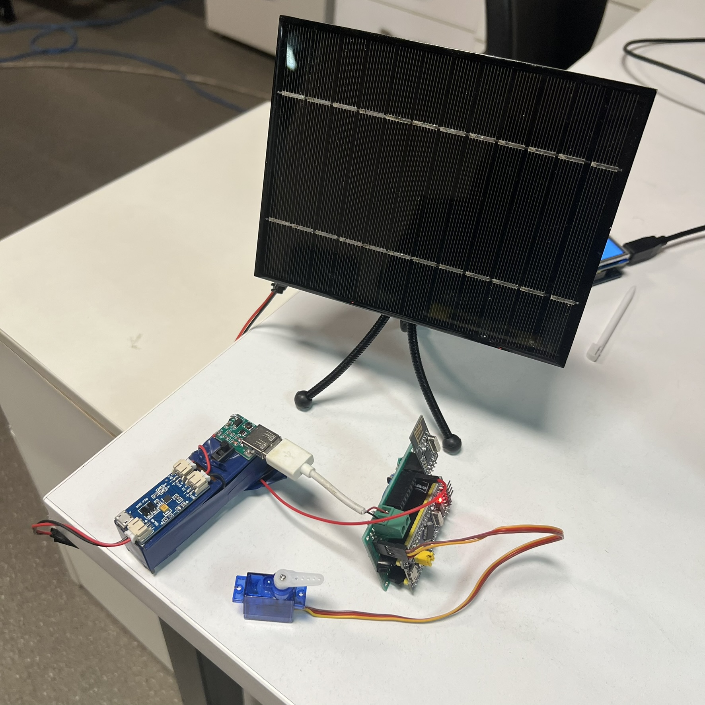
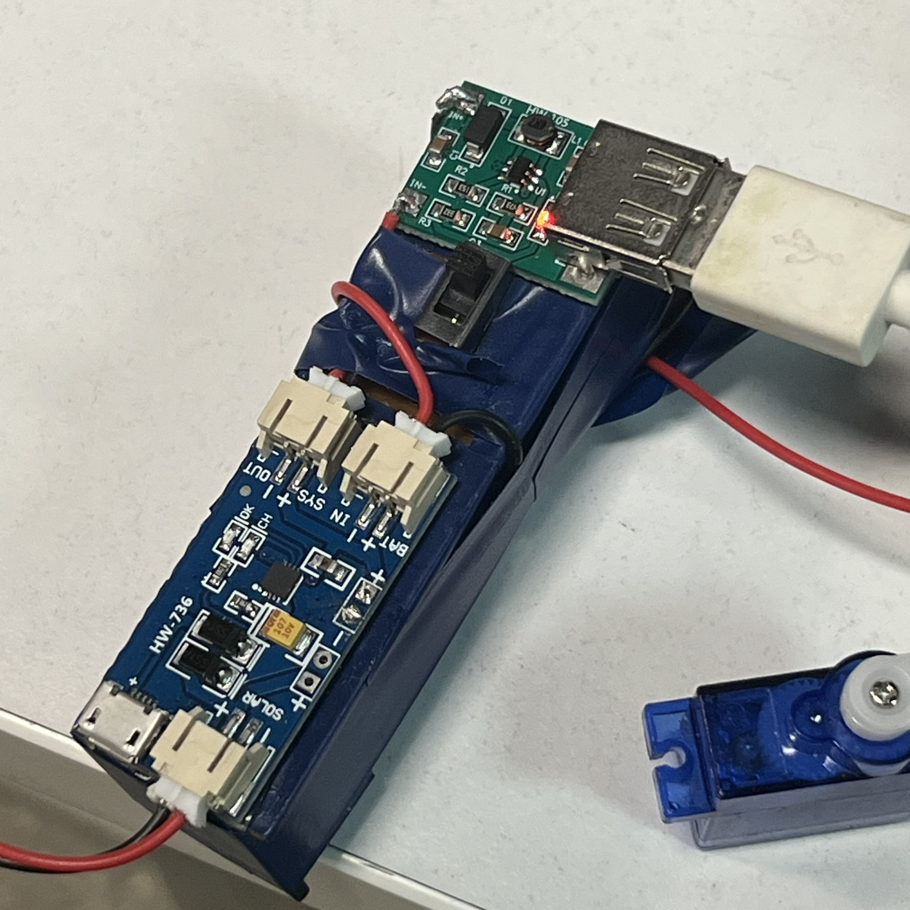
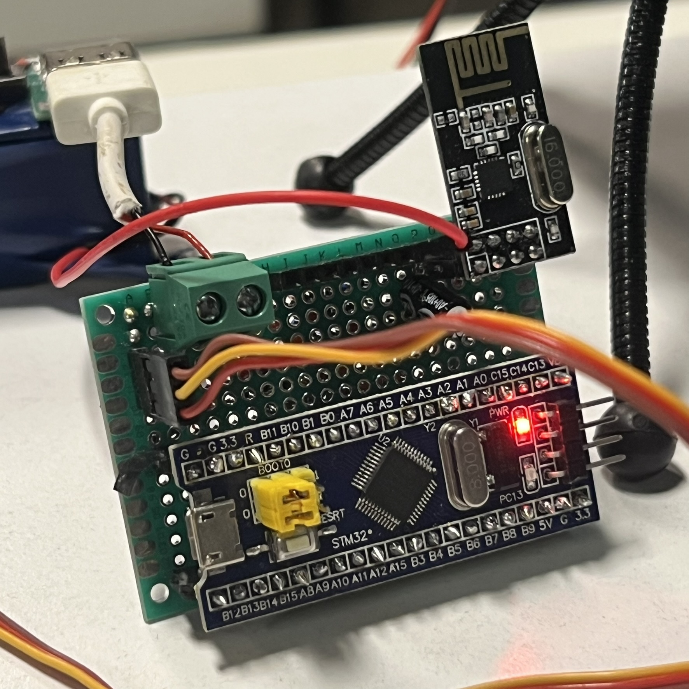

# Wireless Solar-Powered Heating Control System (STM32 + nRF24L01 + Raspberry Pi 5 + Home Assistant)

This project is a low-power wireless heating controller built around an STM32 microcontroller, an nRF24L01 radio module, and a solar-powered Li-ion supply. It communicates with a Raspberry Pi 5 running Home Assistant (in Docker) using another nRF24L01 module, enabling long-range, low-energy remote actuator control.

A small SG90 servo motor physically adjusts the heating valve, allowing Home Assistant to control the heating system without modifying any electrical wiring.

Designed for outdoor or remote locations, the device runs entirely on a 18650 Li-ion battery, charged by a 6 V 500 mA solar panel through a CN3065 Mini Solar LiPo charger, making it fully autonomous.

### Features

1. Wireless Communication (nRF24L01): Uses the RF24 library for reliable 2.4 GHz communication. Raspberry Pi 5 acts as the central controller (Home Assistant integration). STM32 node receives commands:
    - servo \<angle>
    - on / off (LED control)
    - btlvl (battery measurement)
    - rdoff \<minutes> (deep sleep schedule)

2. Fully Solar-Powered Power System: 18650 Li-ion battery + CN3065 LiPo charger + 6 V solar panel. Low standby consumption using STM32 deep sleep via STM32LowPower. Automatic radio shutdown for long-term power efficiency (temporary wake timers supported).

3. Accurate Battery Monitoring: Battery voltage is measured using:
    - Voltage divider (×2)
    - 12-bit ADC sampling with averaging (16 samples)
    - Calibrated voltage calculation for accurate reporting to Home Assistant.

4. Servo-Controlled Heating Valve: SG90 servo connected to GPIO PA1. Activated only during movement to reduce power consumption. Used to open/close heating valve based on Home Assistant commands.

5. Ultra-Low Power Modes: nRF24L01 radio can be remotely shut down (rdoff \<minutes>). STM32 enters deep sleep for minutes to hours. Wakes using internal RTC or radio interrupt (IRQ).

6. Home Assistant Integration: Raspberry Pi 5 hosts Home Assistant in Docker. A matching nRF24L01 USB or GPIO module communicates with this STM32 node. Allows automations such as:
    - Scheduled heating adjustments
    - Temperature-based servo movements
    - Battery health monitoring
    - Remote wake/sleep management

### Prerequisites

Parts used:
- STM32F103C6
- 18650 Li-ion battery (2600 mAh)
- [3A BMS Protection Board](https://www.amazon.com/KOOBOOK-Protection-Solder-Lithium-Battery/dp/B07W75BQWW/ref=sr_1_3?sr=8-3)
- [CN3065 Mini Solar Lipo Charger](https://www.amazon.com/HiLetgo-Charger-Lithium-Application-Charging/dp/B082F7X8WS)
- [SG90 Servo Motor](https://www.amazon.com/Smraza-Helicopter-Airplane-Control-Arduino/dp/B07L2SF3R4/ref=sr_1_1_sspa?sr=8-1-spons&sp_csd=d2lkZ2V0TmFtZT1zcF9hdGY)
- [6V 500 mA Solar Panel](https://www.amazon.com/XINI-INDUSTRIAL-145x145mm-Monocrystalline-Polysilicon/dp/B08QFGYNYF)
- [nRF24L01 Radio Transciever](https://www.amazon.com/HiLetgo-NRF24L01-Wireless-Transceiver-Module/dp/B00LX47OCY/ref=sr_1_2_sspa?sr=8-2-spons&sp_csd=d2lkZ2V0TmFtZT1zcF9hdGY&psc=1)
- [100uF 100V Electrolytic Capacitor](https://www.amazon.com/10x20mm-Electrolytic-Capacitor-Aluminum-Capacitors/dp/B0F8C2R6BF/ref=sr_1_8?sr=8-8)
- [100K ohm Resistor (x2)](https://www.amazon.com/EDGELEC-Resistor-Tolerance-Resistance-Optional/dp/B07HDG9K8P/ref=sr_1_1_sspa?sr=8-1-spons&sp_csd=d2lkZ2V0TmFtZT1zcF9hdGY&psc=1)

### Schematics
#### nRF24L01
- VCC -> 3.3V
- GND -> GND
- CE -> PB0
- CSN -> PA4
- IRQ -> PA0
- SCK -> PA5
- MOSI -> PA7
- MISO -> PA6

#### SG90 Servo Motor
- VCC -> 5V (from USB 5V step-up regulator)
- GND -> GND
- SIGNAL -> PA1

#### Power
- 18650 Battery + / - -> BMS Protection + / -
- BMS Protection P+ / P- -> CN3065 BAT+ / BAT–
- BMS Protection P+ / P- -> Voltage Divider
- Voltage Divider -> STM32 A9
- Filtering Capacitor (100 nF 100 V) -> nRF24L01 VCC and GND
- Solar Panel (6 V 500 mA) + / - -> CN3065 SOLAR IN + / –
- CN3065 OUT+ -> 5V Step-Up Regulator IN+
- CN3065 OUT– -> Regulator IN–
- 5V USB Step-Up Regulator

